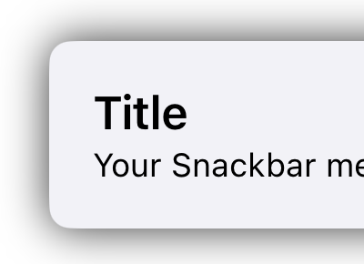

# SwiftUI-Snackbar  
An easy-to-use and highly customizable Snackbar for SwiftUI.  
---

## 📸 **Samples**  


---

## 🚀 **Features**  
✅ Key features of the package:  
- **Position** – Configure the snackbar to appear at the top, center, or bottom of the screen.  
- **Left Icon** – Configure a predefined icon or a custom image.  
- **Right Action** – Set an action with text or an image.  
- **Decorator** – Customize the background color, title and message colors, and the snackbar's maximum width.  
- **Properties** – Adjust the position, duration, and haptic feedback behavior.  

---

## 🛠️ **Installation**  

### **Swift Package Manager (SPM)**  
Add the following dependency to your `Package.swift` file:  

```swift
dependencies: [
    .package(url: "https://github.com/chrisnyw/SwiftUI-Snackbar", from: "1.0.0")
]
```

Alternatively, add it using Xcode:  
1. Go to **File > Swift Packages > Add Package Dependency**  
2. Enter the URL: `https://github.com/chrisnyw/SwiftUI-Snackbar`  
3. Choose the latest version  

---

## 📖 **Basic Usage**  
Import the package and start using it:  

```swift
import SwiftUISnackbar

struct SnackbarDemoView: View {
    @State private var snackbar: Snackbar?

    var body: some View {
        Button(
            action: { snackbar = Snackbar(title: "title", message: "message") },
            label: { Text("Show Snackbar") }
        )
        .snackbarView(snackbar: $snackbar)
    }
}
```

That's it—easy!  


---

## ⚙️ **Advanced Usage**  
Here is the full configuration of the Snackbar:

```swift
Snackbar(
    title: "Demo Full",
    message: "Your message goes here!",
    properties: Snackbar.Properties(
        position: .bottom,
        duration: .fixed(seconds: 5),
        disableHapticVibration: true
    ),
    icon: .system(imageName: "info.circle.fill", color: .white),
    action: .text("Tap me", .red, { print("Tapped me") }),
    decorator: Snackbar.Decorator(
        backgroundColor: .black,
        titleTextColor: .orange,
        messageTextColor: .yellow
    )
)
```

Output:  


---

## 🔧 **Configuration**  
This Snackbar is highly customizable. Below is a list of all available configuration options:

| Property | Type | Description | 
|---|---|---|
| `title` | `String?` | Optional title text. Details: [Title](#title) |
| `message` | `String` | Required message text. Details: [Message](#message) |
| `properties` | `Properties` | Snackbar properties. Details: [Properties](#properties) |
| `decorator` | `Decorator` | Background and text color settings. Details: [Decorator](#decorator) |
| `icon` | `Icon` | Icon on the left side of the snackbar. Details: [Icon](#icon) |
| `action` | `Action` | Action on the right side of the snackbar. Details: [Action](#action) |


---

### **Title**  
Set an optional title for the Snackbar. If `title` is `nil`, the message will be center-aligned.  

---

### **Message**  
Set the message text for the Snackbar. It will automatically expand to display multiline content if needed.  

---

### **Properties**  

| Property | Type | Description |
|---|---|---|
| `position` | `Position` | Configure the snackbar position. See: [Position](#enum-position) |
| `duration` | `Duration` | Set how long the snackbar will be displayed. See: [Duration](#enum-duration) |
| `disableHapticVibration` | `Bool` | Disable haptic feedback when the snackbar appears |

---

#### **Enum: Position**  

| Case | Raw Value | Description | Screenshot |
|---|---|---|---|
| `top` | `"top"` | Display the snackbar at the top of the screen |  |
| `center` | `"center"` | Display the snackbar at the center of the screen |  |
| `bottom` | `"bottom"` | Display the snackbar at the bottom of the screen |  |

---

#### **Enum: Duration**  

| Case | Parameters | Description |
|---|---|---|
| `fixed` | `seconds: TimeInterval` | Display the snackbar for a fixed duration (in seconds) |
| `infinite` | – | Display the snackbar indefinitely |

---

### **Decorator**  

| Property | Type | Description |
|---|---|---|
| `width` | `Double` | Set the snackbar's maximum width |
| `backgroundColor` | `Color` | Set the snackbar's background color |
| `titleTextColor` | `Color` | Set the title's text color |
| `messageTextColor` | `Color` | Set the message's text color |

---

### **Icon**  

| Case | Parameters | Description | Screenshot |
|---|---|---|---|
| `none` | – | No icon |  |
| `error` | – | Display an error icon |  |
| `warning` | – | Display a warning icon |  |
| `success` | – | Display a success icon |  |
| `info` | – | Display an info icon |  |
| `system` | `imageName: String`, `color: Color` | Display a system icon with the specified image name and color |  |
| `customImage` | `imageName: String` | Display a custom icon with the specified image name |  |

---

### **Action**  
Define the supported actions. You can capture a callback when the user taps the action button.  

| Case | Parameters | Description | Screenshot |
|---|---|---|---|
| `none` | – | No action |  |
| `xMark` | `Color` | Display an "X" mark with the specified color |  |
| `text` | `String`, `Color`, `ActionHandler` | Display a text button with the specified text, color, and action handler |  |
| `systemImage` | `String`, `Color`, `ActionHandler` | Display a system image with the specified name, color, and action handler |  |
| `imageName` | `String`, `ActionHandler` | Display an image with the specified name and action handler |  |

---
